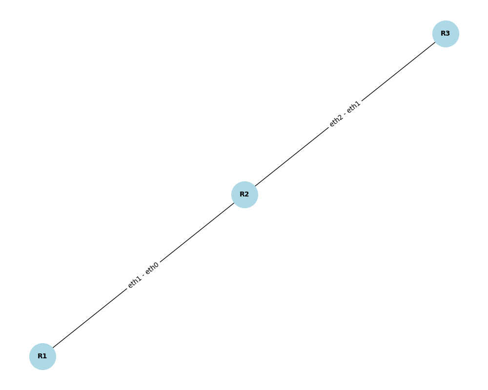

# Rapport simulation réseau statique

## 1. Capture d'écran tests

### 1.1. Route

```
Route locale : 192.168.1.0/255.255.255.0 via - sur eth0
Route distante : 192.168.2.0/255.255.255.0 via 192.168.1.254 sur eth0
192.168.1.25 appartient au réseau ? True
192.168.2.1 appartient au réseau ? False
```

### 1.2. Routeur

```
Table de routage du routeur R1:
----------------------------------------
192.168.1.0/255.255.255.0 via - sur eth0
192.168.2.0/255.255.255.0 via 192.168.1.254 sur eth0
0.0.0.0/0.0.0.0 via 192.168.1.1 sur eth0
----------------------------------------
Table de routage du routeur R2:
----------------------------------------
192.168.2.0/255.255.255.0 via - sur eth1
----------------------------------------
Paquet de 192.168.1.10 à 192.168.2.5 acheminé via 192.168.2.0/255.255.255.0 via 192.168.1.254 sur eth0
Paquet de 192.168.1.10 à 8.8.8.8 acheminé via 0.0.0.0/0.0.0.0 via 192.168.1.1 sur eth0
```

### 1.3 Réseau

_Test réseau complet_

```
🌐 Réseau Entreprise_A :
Routeurs : R1, R2, R3
Connexions :
  - R1 (eth1) <--> R2 (eth0)
  - R2 (eth2) <--> R3 (eth1)


🔹 Test 1: Transmission locale (R1 -> R1)
📡 Transmission depuis R1...
✅ Paquet livré à 192.168.1.25 via R1 !

🔹 Test 2: Transmission vers réseau distant (R1 -> R2)
📡 Transmission depuis R1...
➡️ Appuyez sur Entrée pour continuer...
📡 Transmission depuis R2...
✅ Paquet livré à 192.168.2.25 via R2 !

🔹 Test 3: Transmission impossible (R1 -> Réseau inconnu)
📡 Transmission depuis R1...
🚫 Aucun chemin trouvé depuis R1 vers 192.168.4.25.
Appuyez sur une touche pour continuer...
```

### 1.4 Capture réseau


